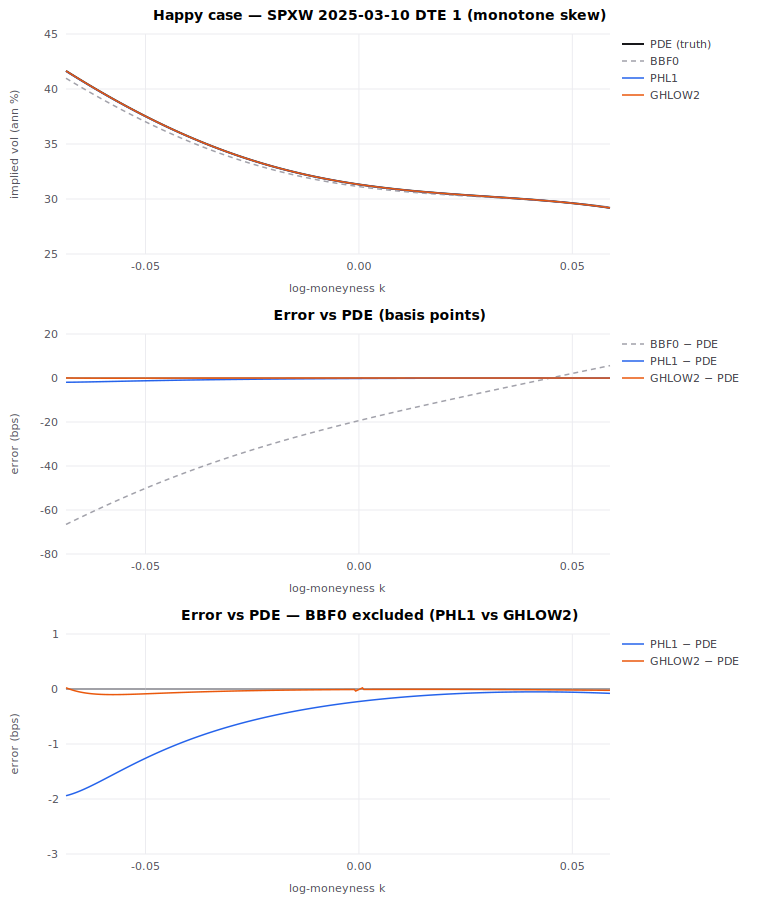
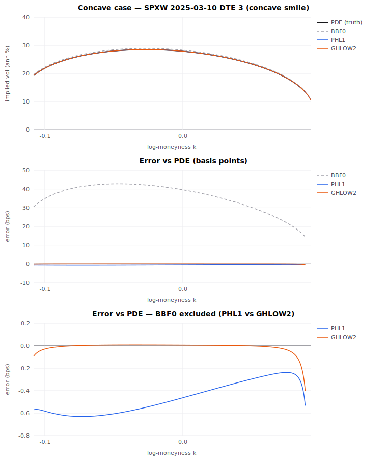
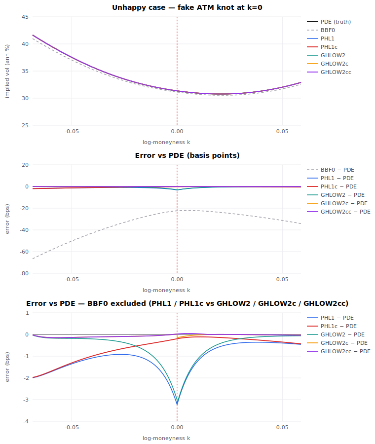
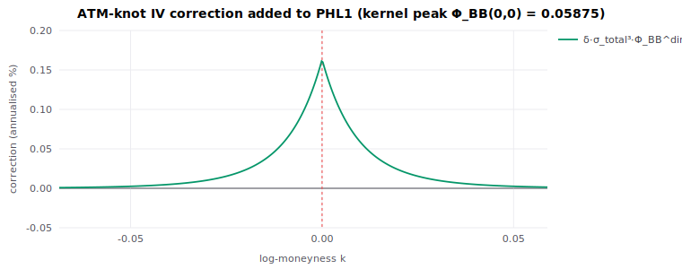

# Implied volatility at a cubic local-vol knot pinned at the money

A focused note + in-browser tool on a practical question: the standard way
to parametrise an implied-vol surface is to fit a local-vol cubic and push
it through the leading-order **BBF0** map. BBF0 can calibrate essentially
any smile — its weakness is not fit but **arbitrage consistency**: being
leading-order, the implied vol it returns is not the model's true Dupire
IV, so a quote-matching surface can still carry small static-arbitrage
slack. **PHL1** (next order) is much closer to the true Dupire IV and buys
that arbitrage reassurance, but a single smooth cubic through PHL1 is
rigid. Adding a **knot** would restore flexibility — except PHL1 develops a
localised error at the knot (the surface is only C², PHL1's σ₁ needs C³).
This work removes that error in closed form **for a knot pinned at the
money (k = 0)**, making "piecewise-cubic-with-ATM-knot + PHL1" a usable
parametrisation that keeps PHL1's arbitrage reassurance while regaining
calibration flexibility. BBF0, a harmonic-mean integral, is insensitive to
the knot and has no knot-specific error.

- **Interactive page** (all computation in your browser):
  https://frenchcommando.github.io/2piece/
- **Research note** (PDF): built by GitHub Actions from
  `paper/2piece-paper.tex` (download the `2piece-paper` artifact from the
  latest *Build paper* run).

This is the simple, cleanly observable subset of a broader unfinished study:
the general case puts the knot at an arbitrary offset `w = k_knot/σ_total`,
which forces an unbounded-polynomial hack to keep the correction finite.
Pinning the knot to **k = 0 (w = 0)** removes that entirely and gives a clean
closed form — that is the whole reason for the restriction.

## The setup

Local volatility is a single cubic in log-moneyness `k = log(K/F)`, in
annualised %:

```
σ_loc(k) = σ + β·k + α·k² + γ·k³
```

A knot at the money adds a jump `δ` in the cubic coefficient on the call side
only (the `k ≤ 0` side is untouched):

```
σ_loc(k) = σ + β·k + α·k² + γ·k³ + δ·k³·H(k)        H = Heaviside
```

`σ_loc` stays C²-continuous at `k = 0`; only the third derivative jumps. This
is exactly what a piecewise-cubic vol calibrator produces, and it breaks the
smoothness assumption behind the standard asymptotic maps.

## The methods

Total vol uses the `T = 1` convention; `scale = √(252/n) · 100` converts
total vol ↔ annualised %, with `n = max(1, DTE)` business days and
`σ_total = σ/scale` the ATM total vol.

**BBF0** — leading-order inverse harmonic mean (Berestycki–Busca–Florent):

```
BBF0(k) = k / ∫₀ᵏ dy / σ_loc(y)            BBF0(0) = σ_loc(0)
```

**PHL1** — BBF0 + the first-order σ₁ heat-kernel correction
(Henry-Labordère's heat-kernel expansion; we use the explicit per-strike
closed form of Gatheral–Hsu–Laurence–Ouyang–Wang, Thm. 2.4, and keep the
conventional label "PHL1"):

```
PHL1 = iv_hm + σ₁ ,
σ₁(k) = iv_hm³/(2k²) · log( √(σ_loc(0)·σ_loc(k)) / iv_hm )
```

(evaluated cancellation-free from the cubic coefficients near `|k| < 1e-3`).

**GHLOW2** — PHL1 + the Gatheral–Hsu–Laurence–Ouyang–Wang second-order
σ₂ term (their eq. 3.19, time-homogeneous, r = 0):

```
σ₂ = -3σ₁/d² + 3σ₁²/(2·iv_hm) + ξ³/(8d⁵) + ξ·(u₁/u₀)/d³ ,
ξ = -k ,  d = ξ/iv_hm ,  u₁/u₀ = Yoshida heat-kernel ratio
```

**Dupire PDE** — the ground truth. The forward equation in log-moneyness
(`F = 1`, `r = 0`)

```
∂C/∂T = ½ σ_loc(k)² (∂²C/∂k² − ∂C/∂k)
```

is solved with a Rannacher start (2 backward-Euler steps to damp the
payoff-kink) then Crank–Nicolson, Dirichlet boundaries on a widened domain.
Implied vol is recovered by inverting Black on the (out-of-the-money)
undiscounted price. At the deep wings the option's time value underflows and
the implied vol is genuinely unrecoverable — those points are dropped rather
than faked, so the curves end where the approximation is meaningful.

## The correction (the contribution)

To first order in the knot jump `δ`, the implied-vol error is the
first-order Duhamel kernel `K_1` — the first-order term of the Dyson series
for the perturbed call-price evolution against constant-σ Black, written
in its Brownian-bridge form (the bridge framing is bookkeeping for the
small-T scaling, not separate machinery). With `x = k/σ_total` and the
knot at ATM (`w = 0`):

```
K_1(x,0) = ∫₀¹ (λ(1−λ))^{3/2} f(η) dλ ,   η = x·√(λ/(1−λ))
f(η)     = (η³+3η)·Φ(η) + (η²+2)·φ(η)            (truncated 3rd moment)
peak K_1(0,0) = 3√(2π)/128 ≈ 0.05875
```

PHL1 already absorbs part of this through its own `iv_hm`/`σ₁` variation;
subtracting that piece (so it is not double-counted) gives the *directed*
kernel `K_1^dir`, which decays on both sides:

```
K_1^dir(x,0) = K_1(x,0) − x³/4 − x/4      (x > 0; = K_1 otherwise)
```

The corrected method is then

```
PHL1c(k)    = PHL1(k)   + δ·σ_total³·K_1^dir(k/σ_total, 0)
GHLOW2c(k)  = GHLOW2(k) + δ·σ_total³·K_1^dir(k/σ_total, 0)   (same universal kernel, T² baseline)
GHLOW2cc(k) = GHLOW2(k) + δ·σ_total³·K_1^ext(k/σ_total, 0)   (extended kernel, also kills σ₂'s value jump)
```

with the baseline evaluated on the perturbed surface (so the cancellation is
exact to first order). The extended GHLOW2cc kernel subtracts σ₂'s
δ-variation in addition to BBF0's `x³/4` and σ₁'s `x/4` — the only
parametric (`β,α,γ`-dependent) piece, still bounded thanks to `w=0`. The
full derivation is in [`paper/2piece-paper.tex`](paper/2piece-paper.tex).

## Figures

Happy case — calibrated SPXW 2025-03-10 DTE 1 (monotone skew, no knot). BBF0
sits ~67 bps off the PDE; PHL1 and GHLOW2 essentially nail it:



Concave case — calibrated SPXW 2025-03-10 DTE 3. The converted smile is
concave; the approximation holds where vol is positive and the deep wings
are correctly trimmed:



Unhappy case — the happy cubic with a fake knot moved to k = 0. PHL1 alone is
biased near the knot; PHL1c repairs the σ₁ slope kink. Stacking the same
universal kernel on GHLOW2 gives **GHLOW2c** (≈0.16 bps max error, but
still carries a −0.171 bps σ₂(0) value jump at the knot). The extended
kernel **GHLOW2cc** subtracts σ₂'s δ-variation too and is
value-continuous at k=0 (≈0.4 bps max error). Three panels: smile, error
with BBF0, and error with BBF0 excluded so the corrected residuals are
legible:



The two pieces of the ATM-knot correction in annualised %: solid green is
the universal kernel (PHL1c−PHL1 = GHLOW2c−GHLOW2, dimensionless peak
`3√(2π)/128`, scaled by `δ·σ_total³`); dashed purple is the σ₂ extension
piece (GHLOW2cc−GHLOW2c) — the small `(β,α,γ)`-parametric bit the
extended kernel adds on top of the universal one. The extension lives
only on `k > 0`, starts at `|Δσ_2(0)| = 0.171 bps` (closing the value
jump), and decays to zero as the clip engages:



## Running locally

Requires Node (≥ 20). No other runtime dependencies.

```bash
npm install
npm run dev        # interactive page at http://localhost:5173
npm test           # cross-check the TS math against the reference fixture
npm run figures    # regenerate figures/*.svg ; `git diff` should be empty
npm run build      # production build into dist/ (what Pages serves)
```

The figures are deterministic: `npm run figures` then `git diff figures/`
should show no changes — that is how you confirm the committed images match
the code.

## How it is validated

`src/math` is the single source of truth. Two cross-checks run in CI on
every push: (i) `tests/reference.json` is a frozen numerical fixture and
`npm test` checks the math core reproduces it — BBF0/PHL1/GHLOW2 to 1e-6,
K_1 to 1e-9; (ii) the full knot-case model is checked against the Dupire
PDE (independent operator, independent discretisation) within tolerance.

## Layout

```
src/math/    bbf0 phl1 ghlow2 pde kernel cubic normal gl model   (the maths)
src/ui/      main controls chart                                 (the page)
src/figures/ generate svg                                        (committed figs)
src/util.ts  byId / getContext2D / findOrThrow / mapGet helpers
examples/    params.json   (calibrated SPXW cases)
tests/       reference.json + cross-check against the frozen fixture
paper/       2piece-paper.tex refs.bib   (LaTeX note; PDF built in CI)
figures/     committed deterministic SVGs (README + paper share these)
memory/      project CLAUDE memory (repo is self-contained)
NOTES.md     working log: math, decisions, status
```

## Credits

Market data for the calibrated example smiles: **ThetaData**.

## License

MIT — Copyright (c) 2026 Martial Ren. See [`LICENSE`](LICENSE).
